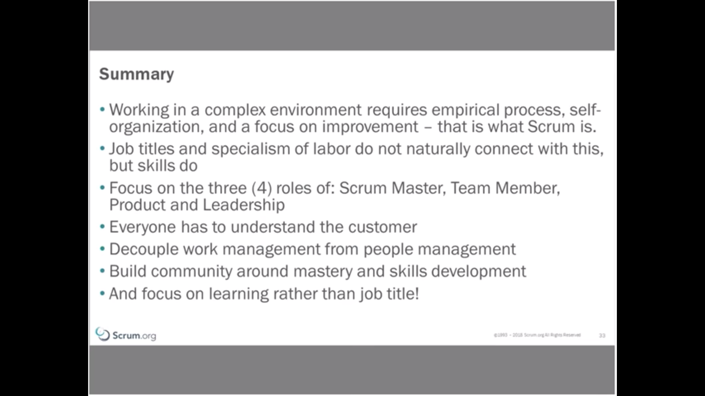

https://www.scrum.org/resources/blog/agile-constant-change

 Simon Reindl

After a short time you and your team should reflect on what has happened, and how it affected the performance within the team. Building on the better understanding, the team should decide what they will do to enhance the good things, and remove the bad things – that is you should focus on changing the environment to be better. This means that things will be different. If the situation is not different, then you have not acted on the learning (or your team are perfect).

 In the movie Groundhog Day, the weatherman (Phil) realises that he is repeating the same day. He then goes wild and breaks all the rules, and after he gets bored and then focuses on improving. He then makes each day a little better than the previous day – until he gets the perfect day.

 Limit the number of things that you are going to change. If it is a significant or challenging thing, then only take one action. Talk about this item in each Daily Scrum.

 ------

 https://www.scrum.org/resources/empiricism-essential-element-scrum

Mark Noneman

thermostat

samples temperaure in room
comparing inspecting temperaure & goal temperature.

adjust tempetretaure According to the goal.

if inspecting value & goal are equal, it still will conntinue inspecting.

3 things for empricisim to work

you have to know what the goal is
inspect frequently enough to keep temp under control
transparency (knowing excactly whats going on) know the environment (for the thermostat example, if you are checking temperature at tea time which teapot is close to the themostat, this is something environmental you shgould know)

inspect and adapt - the goal must be cristal clear.

-------
Escaping the Predictability Trap
Kurt Bittner

-   Instead of demanding predictable plans, focus on articulating clear goals and clearly framing experiments, including how you will evaluate them, and be open to learning new things.

-  - Managers love focusing on productivity and “efficiency” but frequently fail to consider the value that is being delivered. Delivering value is what is important, not how many “units of work” (like story points, which are themselves just guesses) were delivered. What is better: driving 100 miles per hour in the wrong direction, or one mile per hour in the right? Productivity is important, but tracking does not help to improve it. Instead, focus your efforts on removing waste and impediments, and clearly articulating goals. When walking a rough and uncertain path, it’s not how fast you go that matters but whether you reach your destination. To go faster, place smaller bets, run shorter experiments, and evaluate where you are more frequently; you’ll save time not having to backtrack later.

- The problem is that we are not very good at anticipating the future, and we really have no idea of the kinds of opportunities we may encounter along the way. It may seem a bit scary that we really don’t know where we are headed, and that luck plays a large part in what we end up doing. The reality is that we cannot really imagine what jobs will exist in ten years, or even five, nor can we conceive that many of today’s jobs will no longer exist. So how to do we prepare ourselves for what lies ahead? By cultivating flexibility, by trying new things, and by solving hard problems and acquiring whatever skills we need to do so. In the end, adaptability and ability to learn quickly are the keys to success, not steadily marching to the beat of someone else’s drum. Just as with Scrum, we succeed personally by trying new approaches and evaluating the results, in measured experiments.

- “Transformation” is a word that I often associate with the phrase “magical thinking”: organizations seem to believe that they can predictively plan how they are going to “become agile”.  This is usually based on the misconception that agile is a process, or is rather like a tool, that can be “installed” or “rolled out” to an organization. It doesn’t work that way. Agility, or the word I think better captures the essence of what we seek, adaptability, is a cultural quality, a way of thinking and acting that deeply changes the way that people see and act in the world. It is not a specific set of practices or behaviors that can be adopted. It is a way of thinking and acting that involves continually seeking better results and better outcomes. As such, specific practices will change as conditions and skills change. We cannot plan how this is going to proceed, and as different teams have different challenges, their path toward agility will be different. There is no “magical” set of practices, roles, or processes that makes this easier.

- As manufacturers learned, “lean” manufacturing involved a lot more than installing andon cords to enable the line to be stopped; it relied on the cultural values that let any employee pull the andon cord if they see something that is wrong. In pursuit of agile cultural values, organizations will find that agility may look messy on the surface, as different teams make different decisions in pursuit of their own continuous improvement toward their own goals. What is predictable is the empirical approach that defines our path: making observations, forming experiments on how we think we can improve, and continually seeking better performance. 

----------

scrum values poster

https://scrumorg-website-prod.s3.amazonaws.com/drupal/2018-05/ScrumValues-Tabloid.pdf

-------

https://www.scrum.org/resources/blog/5-scrum-values-take-center-stage

Dave West

Successful use of Scrum depends on people becoming more proficient in living these five values. People personally commit to achieving the goals of the Scrum Team. (scrum values)

common misunderstandings

These values sound easy? Well, there are many misunderstandings and common problems when applying these values. Here are some examples.

Value Misunderstanding
Getting the value right

Commitment
Committing to something that you don’t understand because you are told to by your boss. Committing yourself to the team and Sprint Goal.

Focus
Focusing on keeping the customer happy. Being focused on the Sprint and its goal.

Openness
Telling everyone everything about all your work. Highlighting when you have challenges and problems that are stopping you from success.

Respect
Thinking you are helping the team by being a hero. Helping people to learn the things that you are good at and not judging the things that others aren’t good at.

Courage
Even after the decision has been made continuing to push back. Being transparent, but willing to change even if that means accepting that you are wrong, or that your opinion is not the direction that the team is going.

Values like anything in Scrum need to be both visible and inspected and adapted on. These are five ideas from my own experience(Dave West) for encouraging the values to be transparent and considered in your Scrum Team:

Put the values on a wall and have each team member write up how they are going to demonstrate the value in their working day.

Add a ‘values moment’ to your retrospective. This gives everyone an opportunity to inspect and adapt on their values.

Introduce a ‘values’ prize. Not a serious prize, but a fun prize that sometimes can be delivered to two people or the whole team when a value has been demonstrated and everyone is aware of it.

The ‘whoops we dropped the value’ prize provides a way of demonstrating courage, but also highlighting when we missed a value. Of course, this prize could end up being a very negative thing so it should always be delivered in a fun way without negative implications.

Getting external managers or stakeholders to demonstrate to the team a value and what it means to them.

---

https://www.scrum.org/resources/intralinks-case-study-scrum-reboot-time-values

 Scrum Values real by focusing on six principles:
• Self-organization
• 7 +/- 2 team size
• Done means done
• Empowered Product Owners
• Servant-leader Scrum Masters
• Scrum Team ownership for adaption
• The delivery of business value

Commitment
We don’t need no stinking Sprint
Retrospective!

Courage
The Sprint Report?

Focus
Daily Scrum for everybody?

Openness
The Scrum Manager? / master

Respect
The Product Steward?

The three pillars of Scrum are transparency,
inspection, and adaptation,

Only when the principle of owning
adaptation was taken seriously
did the Sprint Retrospective
become an opportunity to improve.

-----

https://www.scrum.org/resources/blog/5-metaphors-explore-value-scrum-values

-----
https://guntherverheyen.com/2013/05/03/theres-value-in-the-scrum-values/

A good illustration is how I’ve observed some teams doing their Daily Scrum. Everybody answers the 3 questions (Done? Planned? Impediments?), in a slightly spontaneous way or -worst case- when asked for by a Scrum Master-pretend. But does the team use the meeting to share information, to collaborate in re-planning their work for that day, making sure they don’t get out of line with one another for more than 24 hours, to get the most out of the Sprint, in moving forward to the Sprint goal? Or do they talk to the board instead of to each other? Do they only use the meeting to make sure that the board holds all their micro-tasks so their work is logged?

commitment- is about dedication
focus - time-boxing of Scrum allow us to focus.
Openness -  Respect

Courage - We show courage in not building stuff that nobody wants. Courage in admitting requirements will never be perfect and that no plan can capture reality and complexity. Courage to consider change as a source of inspiration and innovation. Courage to not deliver undone software. Courage in sharing all possible information (transparency) that might help the team and the organization. Courage in admitting that nobody is perfect. Courage to change direction. Courage to share risks and benefits. Courage to promote Scrum and empiricism to deal with complexity.

----
https://www.scrum.org/resources/blog/4-ways-coach-scrum-values

excellent

----

https://www.scrum.org/resources/truth-about-job-titles-scrum

----

https://www.scrum.org/resources/characteristics-great-scrum-team-0

# Characteristics of a Great Scrum Team

  The Product Owner is responsible for:
- Developing and maintaining a product vision and market strategy;
- Product management;
- Ordering and managing the Product Backlog;
- Involving stakeholders and end-users in Product Backlog refinement and backlog
management;
- Alignment with other Product Owners when needed from an overall product, company or
customer perspective...

Devamında product owner nasıl olmalı anlattılıyor, ne kovalamalı, paylaşımı, backlog yönetimi, vs. güzek bir açıklama var. 

Knows the 5 levels of Agile planning. Within Agile, planning is done continuously. Every
product needs a vision (level 1) which will provide input to the product roadmap (level 2). The
roadmap is a long range strategic plan of how the business would like to see the product
evolve. Based on the roadmap, market conditions and status of the product the Product
Owner can plan releases (level 3). During the Sprint Planning (level 4) the team plan and agree
on Product Backlog Items they are confident they can complete during the Sprint and help
them achieve the Sprint Goal. The Daily Scrum (level 5) is used to inspect and adapt the team's
progress towards realizing the Sprint Goal.

The Scrum Master acts as a:
- Servant Leader whose focus is on the needs of the team members and those they serve (the
customer), with the goal of achieving results in line with the organization’s values, principles,
and business objectives3
;
- Facilitator by setting the stage and providing clear boundaries in which the team can
collaborate;
- Coach coaching the individual with a focus on mindset and behavior, the team in continuous
improvement and the organization in truly collaborating with the Scrum Team;
- Conflict navigator to address unproductive attitudes and dysfunctional behaviors;
- Manager responsible for managing impediments, eliminate waste, managing the process,
managing the team’s health, managing the boundaries of self-organization, and managing the
culture;
- Mentor that transfers agile knowledge and experiences to the team;
- Teacher to ensure Scrum and other relevant methods are understood and enacted.

Development Teams have the following characteristics:
- Self-organizing. They decide how to turn Product Backlog Items into working solutions.
- Cross-functional. As a whole, they’ve got all the skills necessary to create the product
Increment.
- No titles. Everyone is a Developer, no one has a special title.
- No sub-teams in the Development Team.
- Committed to achieving the Sprint Goal and delivering a high quality increment

---------
https://www.scrum.org/resources/blog/why-you-need-only-one-product-owner

# Why you need only one po

“Multiple Scrum Teams often work together on the same product. One Product Backlog is used to describe the upcoming work on the product.” (Scrum Guide)

need of multiple product owners
downsizes
why you should have one

----
https://www.scrum.org/resources/blog/5-powerful-things-about-sprint

# 5 Powerful Things About the Sprint

The purpose of a Sprint is to create a potentially releasable product Increment of value to the organization.  It’s that simple.
## Focus

What value is to be delivered is guided by the Sprint Goal, which does not change during the Sprint.  Because… well, focus.

## Predictability

a team that is using Scrum well will be predictable in delivering a “Done” Increment every Sprint.

Sprints have a consistent cadence.  This consistent cadence helps a Scrum Team understand what they are capable of delivering in a period of time.  As a Scrum Team understands this and continues to work together, they can better forecast delivery expectations.

## Control

o the real driver of the length of a Sprint is how often the business needs to inspect the Increment and adapt the direction based on new information.

## Freedom

Sometimes there will be failure.  In fact, failure is a part of learning.  The question is how big of an impact that failure will have. A Sprint limits the impact of failure to the time-box of the Sprint.

----

# Sprint Review
https://www.scrum.org/resources/what-sprint-review - very good
Mobile aoolication example. While stakeholders examining the new features, developers must notice if verything is going well, or capture new idea fromm shs. 
Po Asks shs, this is a great idea, this is the backlog, what can we switch it with ? 
By this way, stakeholders collaborate into process.

Goal of the sprint review is strategic planning. 