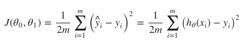
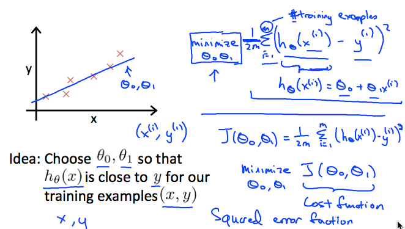
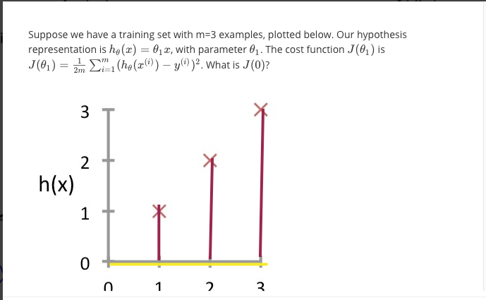
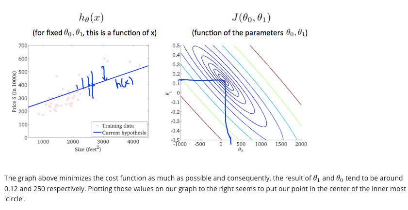
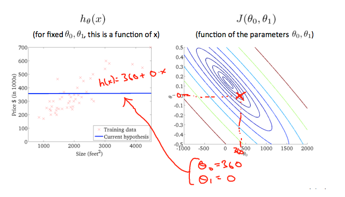
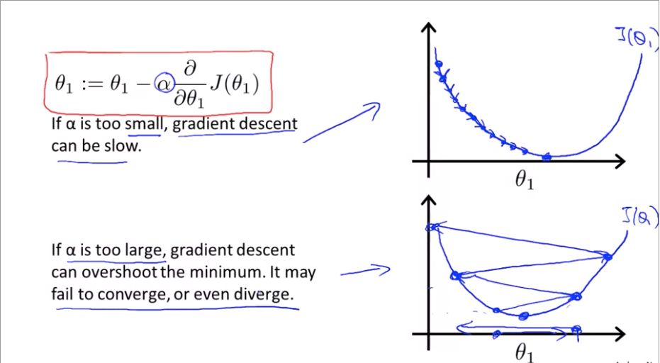
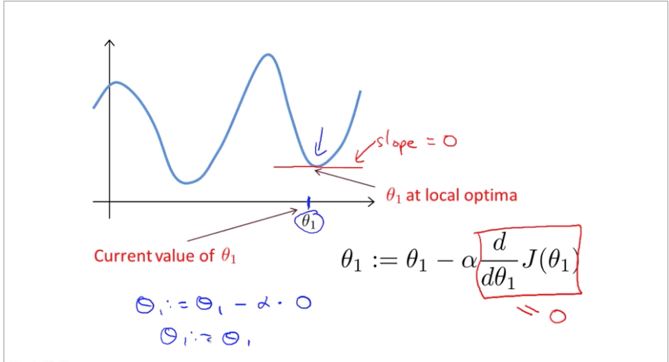

Machine learning algorithms:
- Supervised learning
Supervised Learning
“right answers” given
- Unsupervised learning
Regression: Predict continuous
valued output (price)
----

> Personal notes from machine Learning class of stanford's. Most of the notes are taken from his lecture slides.
https://www.coursera.org/learn/machine-learning/home/welcome

# Linear Regression

## Cost Function

Difference between the predicted value and the actual value.

Ɵ1,Ɵ2 -> ne kadar küçük seçersek costumuz o kadar düşer. 

yukarıdaki soruda amacımız slope a olan uzaklığı bulmak aslında. 
cost function formulunu uyguladığımızda 
j(0) için, yani sarı çizdiğim kısım sklopeumu. oraya olan mesafeleri kullanacağım. cost functioon formülünü koyunce m=3 (toplam datamız)

1/6[(0-1)^2+(0-2)^2+(0-3)^2]

=14/6

# Contour Plot

Contour plot (sağdaki) incelenirken amaç aslında yine aynı. Bu sefer 3 boyutlu bir grafiği x-y düzleminde görüyoruz. 

Özünde cost function en optimal slope u belirleyip (optimalden kasıt ona olan mesafenin minimize edilmesi), contour pltta da durum aynı. Merkeze yaklaşmak amaç. 3-4 data varken bu işler kolay ancak data büyüdükçe imkasnız bir hal alıyor. Burada yazılım devreye giriyor.

aşağıda merkeze yaklaşan bir örnek var ancak yukarıdaki slope, yani aslında hipotizimiz, merkeze daha yakın olduğu için cost function alttakine göre daha düşük. 

# Linear Regression with single variable

## Gradient Descent Intuition

alfa is learning rate. Eğer alfa çok küçük olursa küçük adımlarla ilerler çok zamna alır. 
eğer alttaki gibi büyük olursa çok fazla zıpplar optimumdan uzaklaşırız. 

Soru:

Eğer optimal noktadaysak bir sonraki gradient descent adımı bizi nereye götüreeck  ?

Slope 0 olduğu için sabit kalacağız. Formülde yerine koyunca türevi almaya çalıştığımızda 0 ı göreceğiz. 

The point of all this is that if we start with a guess for our hypothesis and then repeatedly apply these gradient descent equations, our hypothesis will become more and more accurate.

Tabi bu bir nevi brute force bir yöntem. Bundan daha hızlı ve verimli yöntem:
