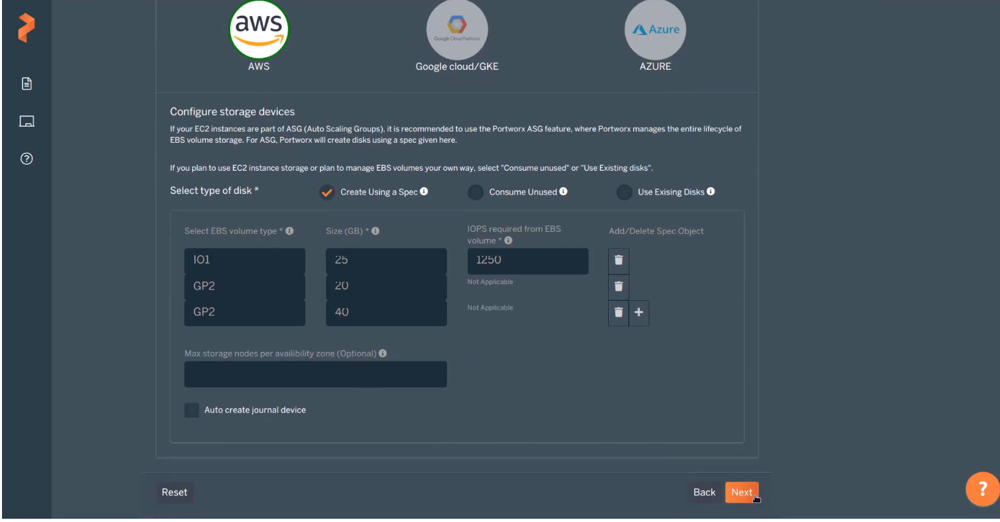

# Cheatsheet

## pxctl status

pxctl status
Status: PX is operational
License: Trial (expires in 30 days)
Node ID: b668a19e-80a6-4699-b40a-66b457943297
        IP: 172.17.0.46
        Local Storage Pool: 1 pool
        POOL    IO_PRIORITY     RAID_LEVEL      USABLE  USED    STATUS  ZONE    REGION
        0       HIGH            raid0           20 GiB  3.0 GiB Online  default default
        Local Storage Devices: 1 device
        Device  Path            Media Type              Size            Last-Scan
        0:1     /dev/vdb        STORAGE_MEDIUM_MAGNETIC 20 GiB          19 Jun 20 20:31 UTC
        total                   -                       20 GiB
        Cache Devices:
        No cache devices
Cluster Summary
        Cluster ID: px-demo
        Cluster UUID: 70eeb4b3-9b92-4781-b127-63bd426c016f
        Scheduler: kubernetes
        Nodes: 3 node(s) with storage (3 online)
        IP              ID                                      SchedulerNodeName       StorageNode     Used    Capacity        Status  StorageStatus       Version         Kernel                  OS
        172.17.0.48     e0f362dd-9aea-4f6d-a0f1-6d23ce142e2f    node02                  Yes             3.0 GiB 20 GiB          Online  Up         2.2.0.5-8a61eb5  4.4.0-62-generic        Ubuntu 16.04.2 LTS
        172.17.0.46     b668a19e-80a6-4699-b40a-66b457943297    node01                  Yes             3.0 GiB 20 GiB          Online  Up (This node)      2.2.0.5-8a61eb5 4.4.0-62-generic        Ubuntu 16.04.2 LTS
        172.17.0.51     3a5a4c6d-ddb1-48da-a5e9-efdff1c72a52    node03                  Yes             3.0 GiB 20 GiB          Online  Up         2.2.0.5-8a61eb5  4.4.0-62-generic        Ubuntu 16.04.2 LTS
        Warnings:
                 WARNING: Persistent journald logging is not enabled on this node.
Global Storage Pool
        Total Used      :  9.1 GiB
        Total Capacity  :  60 GiB

## pxctl service pool show

## pxctl  volume list
## pxctl  volume inspect vol2

output:

Volume  :  668946863730805688
        Name                     :  vol2
        Size                     :  1.0 GiB
        Format                   :  ext4
        HA                       :  1
        IO Priority              :  HIGH
        Creation time            :  Jun 20 21:36:10 UTC 2020
        Shared                   :  no
        Status                   :  up
        State                    :  detached
        Reads                    :  0
        Reads MS                 :  0
        Bytes Read               :  0
        Writes                   :  0
        Writes MS                :  0
        Bytes Written            :  0
        IOs in progress          :  0
        Bytes used               :  340 KiB
        Replica sets on nodes:
                Set 0
                  Node           : 172.17.0.48 (Pool 0)
        Replication Status       :  Detached

On which node is the replica set created for the volume 'vol2'?
use node ip to check which node its bind to answer upper question. (pxclt status includes names and ips together)

## pxctl status --json

prints everything
used it to find gossip port

## pxctl status --json | grep -i gossipport

---

## Aws Deploy Portworx Tips

IO1 volume type
IOPS Required from EBS Volume

50 per gb

Every volume created here refers to pools. 

# Links

https://central.portworx.com/dashboard

https://2.3.docs.portworx.com/install-with-other/docker/standalone/

https://forums.portworx.com/c/portworx-training/19

https://aws.amazon.com/quickstart/architecture/portworx-px-enterprise/

https://2.3.docs.portworx.com/portworx-install-with-kubernetes/storage-operations/create-pvcs/dynamic-provisioning/

https://2.3.docs.portworx.com/install-with-other/operate-and-maintain/scaling/scale-out/

https://2.3.docs.portworx.com/portworx-install-with-kubernetes/operate-and-maintain-on-kubernetes/troubleshooting/scale-or-restrict/

https://2.3.docs.portworx.com/portworx-install-with-kubernetes/storage-operations/create-pvcs/resize-pvc/

https://2.3.docs.portworx.com/portworx-install-with-kubernetes/autopilot/