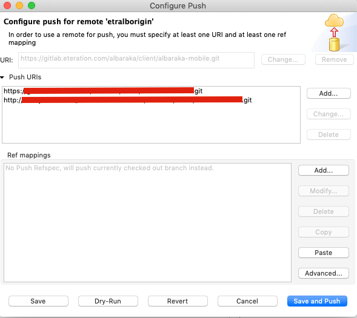

Git Hooks.

Projeye git hook eklemek için projenin hooklarının olduğu dizini yenidens et etmek gerekiyor. Proje dizinine bir klasör açtım adı git-hooks. Sonra aşağıdaki konutu çalıştırdım.

```sh
git config core.hooksPath git-hooks
```

Komutu çalıştırınca .git in altındaki örneklere bakmıyor artık gitimiz hooklar için. hook isimleri özel, değiştirmemek lazım. 

post-commit diye bir dosya ekledim. uzantısı yok. chmod +x post-commit dedikten sonra dosyamız artık çalıştırılabilir özelliğe sahip oldu. 

slack üzerinden bir webhook oluşturmuştum. curl ile o hooku çağırınca slack kanalına mesaj atıyor. 

yaptığım şey son commiti alıp web hooku çağırmak. Artık her committe slacke bildirip düşecek.

post-commit dosyamın içi 

tmpmsg=$(git log -n 1 HEAD)
curl -X POST --data-urlencode "payload={\"channel\": \"#docs\", \"username\": \"webhookbot\", \"text\": \"This is posted to #docs and comes from a bot named webhookbot. See what has been committed --> "$tmpmsg"  \", \"icon_emoji\": \":ghost:\"}" https://hooks.slack.com/services/????????????????????????


-----


Her kullanıcı reposunda yukarıdaki komutu çalıştırmalı. npm olsaydı package.json içerisinden yönetebilirdik ancak npm gibi p.manager ların olmadıpı projelrde herkesin hook dizinini güncellemesi lazım.

----


git remove untracked files

git clean -d -f -f

-------


# git push multiple repos

git remote show origin

git remote add origin2 http://myrepo1.git

* originin yanına ayrı bir alan açıyor. İçine istediğim url i koyabiliyorum. originden ayrı tutmak sağlıklı

git remote set-url --add --push origin2  http://myrepo1.git
git remote set-url --add --push origin2  http://myrepo2.git





Bir repoda önceden commit varsa ezmek için

git push origin2 BRANCIWANTTOPUSH --force

haliyle 2 taaftan pull diyemeyiz. fetch konf,güre edilebilir.
https://jigarius.com/blog/multiple-git-remote-repositories
2 min version


----

ssh key ekleme 

https://help.github.com/en/enterprise/2.17/user/github/authenticating-to-github/generating-a-new-ssh-key-and-adding-it-to-the-ssh-agent


----


# Switching remote urls  https <-> ssh


$ git remote -v
display origin url

$ git remote set-url origin https://github.com/USERNAME/REPOSITORY.git

bunun yerine ssh yazılabilir. 

$ git remote -v
-- Verify new remote URL


-----

remotta olmayan branchi pushlama (origin yerine başka remoteumuzu da yazabiliriz)

git push --set-upstream origin <branch-name>

----

# Push branch to another

```sh
git push origin branch1(source):branch2(destination)
```

or 

```sh
git push <remote> <branch with new changes>:<branch you are pushing to>
```
 
----

# Correct Git repo language

add .gitattributes to the project

* linguist-vendored
*.js linguist-vendored=false

now it is js.

---

# empty commit 

git commit --allow-empty -m "Trigger Pipeline"

---

# total number of commits among all branches

git rev-list --all --count


# number of commits of each author

