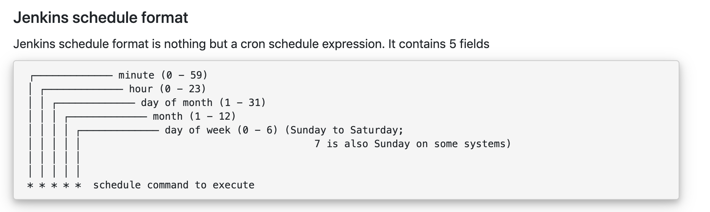
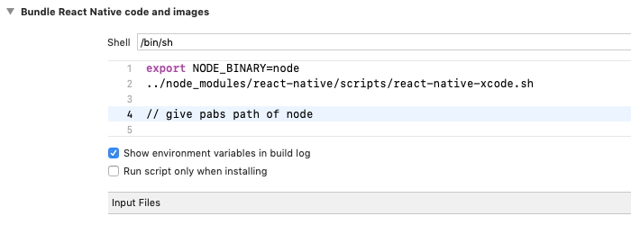

Jenkins slave creation

Master node icerisinde home page altinda manage jenkins basligina tikla.

manage nodes --> new node 

number# of executors ayni anda kac paralel job calisabilir 

remote root dir ? jenkins related dosyalarin slave node da nereye kaydolacagi (slave icinde master konflarin olacagi jnekins directorysi olustur.)

olusturunca pwd diyerek directoryi al. ornegin /home/huseyin/jenkins diye bir dosya olsutrudun. 
remote root directory ye pwd ile pathi alip ekle

label birden fazla makine ile entegre edeceksek ornegin windows tag i  veirsek labeli windows olanlarin hepsi o jobu calistiricak.

Usage: use as much as possible

launch method: bu kisim onemli , launch slave agents via ssh secenegi secilecek. 

buraya host name  eklenecek. ip ile yapiliyor videoda. fakat hostname kullanilabilir.
password ise bilgisayarin sifresi.

credentials kismin da add -> jenkins

kind username & password 

username makina adi, sifre makina sifresi 

simdi credentiali ekle

host key => manually trusted key verification strategy

require manual verification of initial con uncheck!!

availability keep agent online amap.

node properties -> env var secebilirsin

unchecked kalabilir.


--------------


Add nodes to Jenkins(jenkins slave)

# of executors ->> paralel koşabilecek iş sayısı. 

labels -> jobları çalıştırırken içinde ilgili label varsa o job o makinede çalıştırışacak. 


-------------


swap space

Virtual memory is a combination of RAM and disk space that running processes can use. Swap space is the portion of virtual memory that is on the hard disk, used when RAM is full.

----

cron jobs

how to schedule

https://www.lenar.io/jenkins-schedule-build-periodically/




------------


jenkins xcode pluginini kullanırken ios build sırasında PhaseScriptExecution

hatası alındığğında sebebi ya node farklı directoryde kurulmuştur, ya da jenkins node directorysini bulamıyordur. 




xcode da target seçip  build phases adımında "bundle react native code and images aşamasına gelip görseldeki yere node pathini yazıyoruz. node pathini 

```sh
which node
```

komutuyla bulabiliyoruz.

muhtemelen /usr/local/bin/node directorysinde olacak. (default.)


Aldığım hata (jenkins build log)

+ export NODE_ARGS=
+ NODE_ARGS=
+ '[' -z '' ']'
+ export CLI_PATH=/Users/albaraka/jenkins/workspace/Deployment_Master_UAT_IOS/node_modules/react-native/cli.js
+ CLI_PATH=/Users/albaraka/jenkins/workspace/Deployment_Master_UAT_IOS/node_modules/react-native/cli.js
+ '[' -z '' ']'
+ BUNDLE_COMMAND=bundle
+ [[ -z '' ]]
+ CONFIG_ARG=
+ type node
+ nodejs_not_found
+ echo 'error: Can'\''t find '\''node'\'' binary to build React Native bundle'
error: Can't find 'node' binary to build React Native bundle
+ echo 'If you have non-standard nodejs installation, select your project in Xcode,'
If you have non-standard nodejs installation, select your project in Xcode,
+ echo 'find '\''Build Phases'\'' - '\''Bundle React Native code and images'\'''
find 'Build Phases' - 'Bundle React Native code and images'
+ echo 'and change NODE_BINARY to absolute path to your node executable'
and change NODE_BINARY to absolute path to your node executable
+ echo '(you can find it by invoking '\''which node'\'' in the terminal)'
(you can find it by invoking 'which node' in the terminal)
+ exit 2

** ARCHIVE FAILED **

The following build commands failed:
	PhaseScriptExecution Bundle\ React\ Native\ code\ and\ images /Users/

Bu bilgiye react-native modülünün içinde scriptsin altında "react-native-xcode.sh" scriptinde node bulunamayınca çağrılan hatalardan keşfettim. Script içindeki blok : (path: /node_modules/react-native/scripts/react-native-xcode.sh)


nodejs_not_found()
{
  echo "error: Can't find '$NODE_BINARY' binary to build React Native bundle" >&2
  echo "If you have non-standard nodejs installation, select your project in Xcode," >&2
  echo "find 'Build Phases' - 'Bundle React Native code and images'" >&2
  echo "and change NODE_BINARY to absolute path to your node executable" >&2
  echo "(you can find it by invoking 'which node' in the terminal)" >&2
  exit 2
}

adımlarını izleyince node u bulamama problemini çözdüm. 


------------


Xcode Build Error Jenkins: Your session has expired. Please log in

error like this: 


0 : responseId = <CFString 0x7ff48deef220 [0x7fff94b6daf0]>{contents = "40d9ad44-c951-49da-b3f3-b3ea434765a1"}

2 : <CFString 0x7fff94a90b58 [0x7fff94b6daf0]>{contents = "protocolVersion"} = QH65B2

3 : <CFString 0x7ff48dea3420 [0x7fff94b6daf0]>{contents = "requestUrl"} = <CFString 0x7ff48de3d9a0 [0x7fff94b6daf0]>{contents = "https://developerservices2.apple.com/services/QH65B2/viewDeveloper.action"}

6 : <CFString 0x7ff48dec8c30 [0x7fff94b6daf0]>{contents = "userLocale"} = en_US

8 : resultCode = <CFNumber 0x44c37 [0x7fff94b6daf0]>{value = +1100, type = kCFNumberSInt64Type}

9 : userString = <CFString 0x7ff48ded0cc0 [0x7fff94b6daf0]>{contents = "Your session has expired.  Please log in."}

10 : <CFString 0x7ff48dea94d0 [0x7fff94b6daf0]>{contents = "resultString"} = <CFString 0x7ff48de648e0 [0x7fff94b6daf0]>{contents = "authentication.failed"}

11 : httpCode = <CFNumber 0xc837 [0x7fff94b6daf0]>{value = +200, type = kCFNumberSInt64Type}

12 : <CFString 0x7ff48de340f0 [0x7fff94b6daf0]>{contents = "creationTimestamp"} = <CFString 0x7ff48de9a7d0 [0x7fff94b6daf0]>{contents = "2018-10-11T10:19:36Z"}

Solution:

This helped fix the problem with Jenkins running a slave with ssh:

Remove the account via Xcode's preferences
Quit Xcode
In terminal, set the preference to not use the keychain service: defaults write com.apple.dt.Xcode DVTDeveloperAccountUseKeychainService_2 -bool NO
Re-open Xcode and re-add the account

https://stackoverflow.com/questions/52757878/xcode-build-error-jenkins-your-session-has-expired-please-log-in

-------

 sh './gradlew --recompile-scripts --stacktrace'

 yaparen alınan hatanın çözümü


error `fsevents` unavailable (this watcher can only be used on Darwin). Run CLI with --verbose flag for more details.

işe yaramayan çözüm

npm install -g fsevents


https://stackoverflow.com/questions/52427810/error-fsevents-unavailable-this-watcher-can-only-be-used-on-darwin

çözüm

npm r -g watchman
brew install watchman

https://github.com/jest-community/vscode-jest/issues/423

-----------


SDK location not found. Define location with sdk.dir in the local.properties file or with an ANDROID_HOME environment variable.


çözüm


react-native projemizde android dizinine local.properties dosyası eklşiyoruz. İçine 

paste your Android SDK path like below

in Windows sdk.dir = C:\\Users\\USERNAME\\AppData\\Local\\Android\\sdk
in macOS sdk.dir = /Users/USERNAME/Library/Android/sdk
in linux sdk.dir = /home/USERNAME/Android/Sdk
Replace USERNAME with your user name


koyuyoruz. 

https://stackoverflow.com/questions/32634352/react-native-android-build-failed-sdk-location-not-found

----
-
