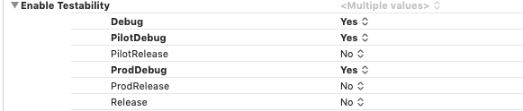
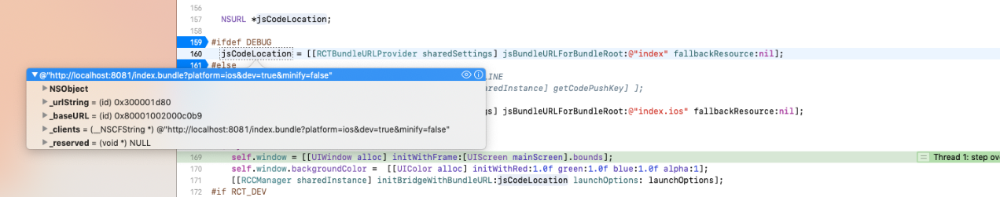
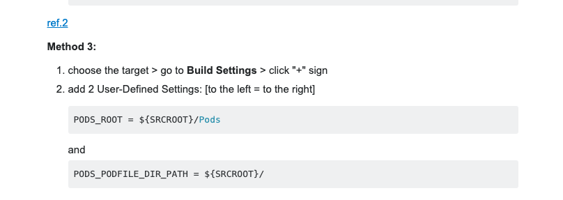

# IOS

## Changing mimimum deployment target.

open related xcconfig configfile
paste following
IPHONEOS_DEPLOYMENT_TARGET = 11
it will be set autoamtically.
devices simulator os lower than 11 will not be listed.


## debug/release frameworku aynı branchte build konfigurasyonuna göre seçme

1) build hases kısmına yeni ir script ekledim
2) ios dizinine Environments klasoru ekledim. İçinde sdk ve ortam (uat/prod) klasörleri var. 
3)yine ios dizinine some klasoru ekledim. İlk başta debug frameworkunu içine xcode dan ekledim. 
!!! Eklerken xcode da sağ klik , add files to ..app, açılan pencerede Destination copy items if needed seçili OLMAMALI, 
added folders kısmı create group reference olacak. Yeni bir şey eklenmeyecek. add to targets kısmında target uygulama seçili olacak. 
 Amacımız some klasöründe ne varsa onu frameworks folderı altına eşleştirmek. frameworks kısmının harici bir yerde framework olursa appp stoe yüklemeye izin vermiyor. 
 Environments klasörünü de yukaıdaki gibi xcode a ekledik. some klasorunu eklemedik. copy bundle resources kısmındda environments ve some klasoru olmamalı. Bu sefer de muhtemelen multiple commands produce hatası verecek. 

 build phases scripti aşağıdaki gibi. Bir de frameforks dizinine some klasöründen framework ekleyince, build phases da son adımlardan biri olarak embed frmeworks adımına destination frameworks, diyip + ya basarak some kutuphanesini refere eden some framewrokunu ekledik. Fazladan build konfigurasyonlarımız varsa debug/release header search pathi güncellenmşiş olacak. Oradaki some pathini diğer konfigürasyonlar için de eklersek her şey harika olacak. 

```sh

DEBUG_SOME_FRAMEWORK=${PROJECT_DIR}/Environments/sdk/debug/Some.framework
UAT_SOME_APP_CONFIG=${PROJECT_DIR}/Environments/uat/assets/app_config.xml
RELEASE_SOME_FRAMEWORK=${PROJECT_DIR}/Environments/sdk/release/Some.framework
PROD_SOME_APP_CONFIG=${PROJECT_DIR}/Environments/prod/assets/app_config.xml

if [ ${PLATFORM_NAME} = "iphonesimulator" ]; then
echo  "copying for simulator"
cp -R -f -v ${DEBUG_SOME_FRAMEWORK} ${PROJECT_DIR}/some
echo  "copied for simulator"
else
echo  "copying for real device"
 cp -R -f -v ${RELEASE_SOME_FRAMEWORK} ${PROJECT_DIR}/some
echo  "copied for real device"
fi

if [ "${CONFIGURATION}" == "Debug" ] || [ "${CONFIGURATION}" == "Release" ]; then
yes | cp -rf ${UAT_SOME_APP_CONFIG} ${PROJECT_DIR}/assets
else
yes | cp -rf ${PROD_SOME_APP_CONFIG} ${PROJECT_DIR}/assets

fi

```


-----


## frameworkun arch uygunluğunu anlamak için 

framework içine girip

lipo -info <FRAMEWORK>
---


## Ios Notes


Obj-c

if (a -> b )

a b tipinde bir şey retıurn etmek zorunda
-----

## Firebase crash log

simulatorde veya cihazda crash logu oluştururken cihazın debugda olmaması gerekiyor.

Make sure that the debugger is DISABLED when you generate the crash in the simulator or attached device, or the debugger will grab the crash before FCR does. Launch the app (⌘R) in Xcode, stop the debugger (⌘.) in Xcode, and re-launch the app manually in the simulator or on the device.

-----
## XCode build variant

2 farklı firebase dosyasını farklı otamlar için aynı branchte kullanma (ios)

build phase için kullanılan script.

*****
```sh

## Name of the resource to copy
INFO_PLIST_FILE=GoogleService-Info.plist

## Get references to debug and release versions of the plist file
DEBUG_INFO_PLIST_FILE=${PROJECT_DIR}/Firebase/Development/${INFO_PLIST_FILE}
RELEASE_INFO_PLIST_FILE=${PROJECT_DIR}/Firebase/Production/${INFO_PLIST_FILE}

## Make sure the debug version exists
echo "Looking for ${INFO_PLIST_FILE} in ${DEBUG_INFO_PLIST_FILE}"
if [ ! -f $DEBUG_INFO_PLIST_FILE ] ; then
echo "File GoogleService-Info.plist (debug) not found."
exit 1
fi

## Make sure the release version exists
echo "Looking for ${INFO_PLIST_FILE} in ${RELEASE_INFO_PLIST_FILE}"
if [ ! -f $RELEASE_INFO_PLIST_FILE ] ; then
echo "File GoogleService-Info.plist (release) not found."
exit 1
fi

## Get a reference to the destination location for the plist file
PLIST_DESTINATION=${BUILT_PRODUCTS_DIR}/${PRODUCT_NAME}.app
echo "Copying ${INFO_PLIST_FILE} to final destination: ${PLIST_DESTINATION}"

## Copy the appropiate file to app bundle
if [ "${CONFIGURATION}" == "Debug" ] ; then
echo "File ${DEBUG_INFO_PLIST_FILE} copied"
cp "${DEBUG_INFO_PLIST_FILE}" "${PLIST_DESTINATION}"
else
echo "File ${RELEASE_INFO_PLIST_FILE} copied"
cp "${RELEASE_INFO_PLIST_FILE}" "${PLIST_DESTINATION}"
fi


```

******
kullandıgım kaynaklar

https://medium.com/@andersongusmao/xcode-targets-with-multiples-build-configuration-90a575ddc687
https://gist.github.com/tylermilner/f8e9121d62c890cb707bc1810a7d57d9


-----


build 
app - project- build settings içerisinde uygulama configleri arasında debuggable olma olmama özelliği seçilebiliyor. Debug kelimesi içeren konfigürasyonlar debuggable geliyor fakat bu değer değiştirielebilir.




---------


Ios ta ekli bir kütüphane (lbrries içinde) 

aşağıdaki modüllleri bulamıyorsa 

React/RCTBridgeModule.h
React/RCTEventEmitter    vb core modülleri bulamıyorsa  node-modules içinde react-native altından react projesinin içinde libReact.a yı xcodeda link library  with binaries altına ekledim.

-----------


içinde clang geçen hatalar compiler ile ilgili. Muhtemelen projede olmayan bir şeyi compile etmeye çaışıyorsun. veya eklediğin bir kütüphaneyi linked llibrary with binaries altına elkemedin. 


---------

tüm simalor vs öldürme 

sudo killall -9 com.apple.CoreSimulator.CoreSimulatorService


-----


react native debug mode da çalışırken ios uygulaması npm e bağlanacağı yer appDelegate.m sayfasında 
jsCodeLocation = [[RCTBundleURLProvider sharedSettings] jsBundleURLForBundleRoot:@"index" fallbackResource:nil]; satırıdır.
 Bağlanacağı adresi dinamik olarak almaktadır. Fakat farklı konfigürasyonda bu alan nil gelmektedir. debug mode da aşağıdaki gibi doğru adresi almaktadır. fakat konfigürasyonu değiştirince gelen değer nil dir. bu sebeple uygulama npm e bağlanamıyor. (bunun bir çözümü olmalı ?)




https://stackoverflow.com/questions/38780325/running-react-native-app-on-ios-device-using-offline-bundle


----------


80-90 tane 64 bitlik mimariye uygun olmayan hatalar çıkarsa sebebi

Make sure JavaScriptCore.framework is added to "Link Binary With Libraries"


-----------------------------------


react native de rctwebsocket debug edebilmek için var.


--------

podfile içindeki ##use_frameworks swift tabanlı podlar için var. Hem swift hem obj c podlar birarada olunca birbirine dependent kütüphaneler importları beceremiyor. Bunun çözümü ya yeni eklenen kütüphanenin en sonki obj c halini bulup eklemek, ya da obj-c bridging header da ihtiyac olunan obj c header larını import etmek. Böyle olunca headerlar swift tarafına expose ediliyor ve dependent kütüphaneler birbirini bulabiliyor.

--------


pod update yaparken smartquotes gibi bir hata alırsak cocoapods versiyonumuz eski demektir.

```sh
$ sudo gem install cocoapods
```


---------


iosta birkaç environmentın derlenebldiği bir konfigürasyonunuz var. prebuild scriptlerimizle ortama özgü dosyaları ilgili alanlar kopyalıyoruz. Doğru dosyayı aldığımıza nasıl emin olabiliriz ? 

xcode da appname -appname - products - apnama.app sağ klik show in finder diyoruz. 

finderda app in üstüne sağ klik yapıp show package contents diyoruz. Ben kolaylık olsun diye ilgili klasöre belirleyici bir dosya ekledim


------------


googleapis ile ilgili problem : pod update hazırda bulunan oogleapis dosylarını duzenleyebiliyor. Bu yuzden podları silipo pod install yapmak istersek googleapis için ygenellikle kullanılan post install scripti hata veriyor. (voice assistant) (ios)


-------------


Iosta telefona veya emnulatore atarken uygulamayı this device is not supported hatası için

https://medium.com/swift2go/how-to-run-ios-12-on-real-device-using-xcode-9-51aa51df7c4

--------


Ios ta build numberı otomatik arttırmak için aşağıdaki scripti build phases kısmına ekliyoruz. 


```sh
buildIdentity=$(date +%m/%d/%Y/%H:%M)-$ASSETS_ENVIRONMENTAL_VALUE;
echo "$buildIdentity"
/usr/libexec/PlistBuddy -c "Set :CFBundleVersion $buildIdentity" "${PROJECT_DIR}/${INFOPLIST_FILE}"
```


https://tecadmin.net/get-current-date-and-time-in-bash/ adresinde date nasıl alınır detayları var. 

Yukarıdaki kod bloğu environmentı da build versiyon içerisine basmakta. 


------------

https://github.com/filsv/iPhoneOSDeviceSupport

xcode dan yeni ios versiyonlu cihaza uygulama atmak istediğimizde device not supported problemi için yukarıdaki linkten ihtiyaç olunan versiyon alınır. 

/Users/user/Library/Developer/Xcode/iOS DeviceSupport arasına konur. Xcode u kapatıp açınca telefona atabiliyoruz.

-----------

Ios ta paket çıkarken 

error exportarchive no profiles for 'app' ....

hatası alınıyorsa xcode u kapatıp açınca düzeliyor. (window-->organizer adımından gidince tekrar paket yükleme ekranı açılır. )

-----
how pod install works 
https://medium.com/@scottlydon18/podspecs-podfile-pod-install-what-happens-518af7e6471d

https://www.objc.io/issues/6-build-tools/cocoapods-under-the-hood/


------


xcode da react native podfile.lock ve manifest.lock bulunamıyorsa

https://stackoverflow.com/questions/31738339/the-sandbox-is-not-in-sync-with-the-podfile-lock-ios/35446801


En sonkesin çözüm olabilecek bir şey olarak




-------------

expose from swift to rn and rn to swift

https://teabreak.e-spres-oh.com/swift-in-react-native-the-ultimate-guide-part-1-modules-9bb8d054db03


------

I ran into the same error AsyncStorage is null error when migrating our test app to RN 0.60.0 today.

I resolved the issue by running react-native unlink @react-native-community/async-storage and cd ios && pod install again.

-----


## ios build problemleri (shift+cmd+v)


macho linker -> eksik kutuphaneyi link etmek gerekiyor
--
versiyon uyusmazliklarindan kahynakli build problemlerinde alternatif olarak kontrol edilmesi gereken alanlardan biri commandline tools versiyonu.
---
xcode --> preferences --> command line tools 
---
uygulama baska makinede başka bir xcode versiyonunda başarılı bir şekilde çalışıyorsa alternatif olarak denemek için iyi bir opsiyon.


## ios export certificate with pk

EXPORTING THE CERTIFICATE
Open Keychain Access.
In Category panel, select Certificates.
Select the certificate you want to export (should be named something like: iPhone Distribution: [Original Developer Name]).
Highlight both the certificate and its private key.
Right-click and select Export 2 items.
Select location to save p12 file.
(Optional)Enter a password - this will be used to install it on the other machine.
Press Save.

---
Ios ta pod install yaparken pod command not found için 

```sh
$ sudo gem install cocoapods
```

----


Argument list too long: recursive header expansion failed##1407


Ios/build folder sil

Xcodedan build yap

——————————————

Macho linker 


Proje — build phases — link binary with libraries de istenmeyen bir kutuphane kalmistir

----

POD REINSTALL

Pod deintegrate

pod cache clean --all

pod cache clean 'alamofire'

pod cache clean 'alamofire' --all


Pod install
-----
zipli xcode versiyonunu açarken tarihi geçti vb hatası için bilgisayar tarihini geri çekince durum düzeliyor.


-----------


ios xcode cache temizleme

cmd shift alk k --> clean build folder
rm -rf Pods && Podfile.lock
pod cache clean --all
pod deintegrate


rm -rf "$(getconf DARWIN_USER_CACHE_DIR)/org.llvm.clang/ModuleCache"

Delete derived data

rm -rf ~/Library/Developer/Xcode/DerivedData
 xcode kapalıyken yapılır


-------

Ios'ta notificationları test ederken 

[Failed to push 6dje7djksis7hyhdjshsjksjd74jdjskshdjd8dhjjdkwu for reason 8]
Which is Invalid Token.

şeklinde hata alıyorsak problem appleın notification için 2 mode u olmasından ve kullandığımız sertifikalardan kaynaklı. Ios paketi oluşturduk, debug da iken uygulama bildirim geliyor, debugda değilken bildirim gelmiyor. Problem sertifikalar ve deployment mode u ile ilgili. Eğer konfigürasyonumuz test servislere notification atacaksa enterprise ve ad-hoc mode da çalışmayacak. Yukarıdaki hatayı verecek. Bu modedaki deploymentlarda apple kendi production urline istek atılmasını bekliyor.


------

Iosta headermaps için use headermaps yes dediğimizde "$(BUILT_PRODUCTS_DIR)" pathini verinde debug-iphoneos buildinda podları da build etmeye çalışacak. (podlar swift olmadığı için compile edemeyecek. Buynu detaylandır.)


------


use header maps yes demezsek

bridging header içerisinde ##import "AppDelegate.h" yapınca bulunamadı diyor.
(while exposing objc file to swift)


---------

https://stackoverflow.com/questions/58376586/how-to-fix-pod-install-error-glog-is-too-old-or-missing-react-native-ios-in-wind


xcode-select --switch /Applications/Xcode.app


rn 61.5 için pod install yaparken aldığım hatanın çözümü.


---------


## ios terminalden archive etme

xcodebuild -workspace <ProjectName>/<ProjectName>.xcworkspace -scheme <schemeName> clean archive -configuration release -sdk iphoneos -archivePath <ProjectName>.xcarchive


https://stackoverflow.com/questions/2664885/xcode-build-and-archive-from-command-line


--------
## Xcode build error - Multiple commands produce .o, Target 'ProjectCoreData' has compile command for Swift source files listed twice


build phases kısmında copy pods resources aşamasında "run script only whe installing" seçeneğini checkledim. 


------
## ios için appicon ekleme 

1024x1024 ebatında görseli siteye yükle. 
https://makeappicon.com/

40x40 için bir görsel gelmeyecek fakat 20x20@2x formatındaki görsel 40x40 a denk geliyor.


--------

## how to find team id ? (ios deveopler acount)

https://www.mobiloud.com/help/knowledge-base/ios-app-transfer/

----------


## Profile doesn't match the entitlements file's value for the application-identifier entitlement

identifier için eksra konfigurasyon yapmışız fakat xcode dan konfügüre etmemişiz...örneğin identifier özelliği olarak icloud eklemişiz, xcodeda signing & app capabilities kısmına tanımlamamışız.


----
## Ios build config (variant) ile ilgili önemli not

react native (v60 öncesi)

Library olarak eklediğimizde debug ve release için derleniyor, oluşturduğumuz yeni konfigler için derlenmiyor. 
Build settings altında header search paths e aşağıdaki dizin eklenmeli ki release altından alınabilsin.


Eğer debugdan başka debug edilebilen configlerimiz varsa 
$(BUILD_DIR)/Release-$(PLATFORM_NAME)/include

infopliste aşağıdaki dizini de ekleyip debug olanlara bu dizini vermek lazım.
$(BUILD_DIR)/Debug-$(PLATFORM_NAME)/include


------


## multiple commands produce ... file hatası 
şu anlama eliyor. build phases içersinde copy bundle resources kısmında aynı isimli dosyalar var. yanlış alakasız olanı çıkarmak lazım. 


----------

## kurulu cocoapods versiyonları
gem list cocoapods

birini uninstall etme
sudo gem uninstall cocoapods -v 1.8.4

----


## iosta farklı config dosyaları için ortak header-bridge kullanırken importlarda sıkıntı varsa

app in header search paths kısmına aşağıdaki değeri ekle:

$(BUILD_DIR)/Release$(EFFECTIVE_PLATFORM_NAME)/include


--------

## Debugera bağlanma problemi workaround
  jsCodeLocation = [NSURL URLWithString:@"http://127.0.0.1:8081/index.ios.bundle?platform=ios&dev=true"];
rn 61.5 için 

jsCodeLocation = [NSURL URLWithString:@"http://127.0.0.1:8081/index.bundle?platform=ios&dev=true"];
jscodelocation code push için...

direkt aşağıdaki gibi de güncelleyebilriz.

 ##if DEBUG
  return [NSURL URLWithString:@"http://127.0.0.1:8081/index.bundle?platform=ios&dev=true"];

##else
  return [[NSBundle mainBundle] URLForResource:@"main" withExtension:@"jsbundle"];
##endif
appdelegate dinamik olarak homeadresini bulamazsa jsCodeLocation ı yukarıdaki gibi değiştirebiliriz. 

-----


# ANDROID

---------
# ADB Reverse (physical device fails to connect debugger)

$ adb reverse tcp:8081 tcp:8081 

---

Android  android/build.gradle dizininde

def enableSeparateBuildPerCPUArchitecture = false
parametresi 2 apk oluşturup oluşturmama ayrımına yarar. true verilince arm ve x86 mimarili cihaz hedef alınarak 2 apk oluşturulur. Bu sayede 4mb kadar küçülür uygulama. apk içerisine gereksiz native kod eklenmemiş olur. 2 apk store a birlikte yüklenir. google play ve amazon bu şekilde uygulamayı kabul etmektedir. insanlar indirirken otomatik olarak cihazları için hangisi uygunsa kullanıcıya o gösterilir. apk lara özgü farklı şeyler yapılamamakta. arm olanları 5 tl ye satayım, x86 ları 7 tl ye satayım gibi kurnazlıklar da yapılamamakta . :)


-------

Android Duplicate resoursec problemi ve enteresan cozumu

https://github.com/facebook/react-native/issues/22234

----------


Androidde device id çıkılan paketin identifier ve signed apk/bundle sırasında kullanılan sertifikaya göre silip yüklemelerde değişebilir. 
yani uygulamayı silip kurduk, farklı bir device id oluşabilir. Eğer Cihaz id si seervise gönderilioyr ve bnunlakontrol yapılıyorsa bu bilgi önemli olabilir. Test ederken yaşanabilir. 


------
android build sırasında debugImplementation a kızıyorsa bilgilsayarınızı ingilizce yapın

http://codelama.com/androidstudio-3-3-could-not-find-method-testimplementation-error/


----------


64 bit android support files

https://developer.android.com/jetpack/androidx/migrate/class-mappings

-----


> Directory '/Users/farukyazici/dev/gitlab/client/mobile-branch/android/app/build/extracted-include-protos/debug' specified for prope
rty '$9' does not exist.
> Directory '/Users/farukyazici/dev/gitlab/client/mobile-branch/android/app/build/extracted-include-protos/dev' specified for propert
y '$6' does not exist.
> Directory '/Users/farukyazici/dev/gitlab/client/mobile-branch/android/app/build/extracted-include-protos/main' specified for property '$3' does not exist.


ilgilidizine dosyaları ekleyince çözülüyor. sebebini bilmiyorum.


-----------
react-native android calistirirken
unable to load script from assets index.android.bundle
try running the command:

```sh
adb reverse tcp:8081 tcp:8081
```
---------

Bununla beraber hakikaten assetslerle ilgili problem olabilir.
Bunun icin asagidaki adimlari izleyerek sorun cozulebilir.

https://medium.com/@impaachu/react-native-android-release-build-crash-on-device-14f2c9eacf18

----

yeni clonelanan rn projesinde android studioda module lerin listelenmesi gerekiyor. Gozukmuyorsa sync project with gradle files buttonuna basiyoruz. sag ustte filli icon.

-----

 Bundletool kullanımı
Android paketinin bundle(.aab) uzantılı çıkınca paketi telefona nasıl atarım ? 

java -jar bundletool-all-0.3.3.jar build-apks --bundle=/path/to/app.aab --output=/path/to/my_app.apks --ks=/path/to/release.keystore --ks-pass=pass:changeit --ks-key-alias=key0 --key-pass=pass:changeit

Release paketi oluşturmak için yukarıdaki komutu kullanıyoruz. 

Keystore credentiallarını vermezsek debug modeda paketler oluşturucak. 

komutun sonunda apks olması şart. Tüm apk 

bu bize apks dosyası vericek içinde her cihaza uygun apk var. Tek tek açılmıyor Yine bundletool ile telefona atmak gerekiyor. 


cihaza atmak için
bundletool un olduğu dizine geçiyorum. (bu durumda indirilenler içerisinde)
java -jar bundletool-all-0.3.3.jar install-apks --apks=/path/to//my_app.apks


kaynak: https://developer.android.com/studio/command-line/bundletool

problem olursa 

adb kill-server

durumu çözüyor.
-----

## android . no cached version available


https://stackoverflow.com/questions/22607661/no-cached-version-available-for-offline-mode


-------

## react-native-maps androidde logsuz crash 

edince çözümünde yaptığım:
androoid manifest dosyasına 
<uses-library android:name="org.apache.http.legacy" android:required="false"/>
ekledim.

https://github.com/react-native-community/react-native-maps/issues/2880


----

## gradle cache temizleme

Gradle cache locates at

On Windows: %USER_HOME%\.gradle/caches/
On Mac/Unix: $HOME/.gradle/caches/
You can browse to these directory and manually delete it or run

rm -rf $HOME/.gradle/caches/
on Unix system. Run this command will also force to download dependencies.

Update 2: Clear the Android build cache of current project

Note: Android Studio's File | Invalidate Caches/Restart doesn't clear the Android build cache, so you'll have to clean it separately.

On Windows:

gradlew cleanBuildCache
On Mac or Linux:

./gradlew cleanBuildCache

------

# React Native

## Higher Order Component - HOC 

For example there is commentlist component returning number of comment components.

---

## React native environment hakkında bilgi alma


```sh
$ react-native info env hakkinda bilgi  evriyor

```

-------

## Javascript arrayden objeleri kurtarım başka obje içine yazma.

[ 0: {a: {}},
  1: {c: {}},
  2: {e: {}}
]

olanı 


{
  a:{},
  b:{},
  c:{},
}

bu ihtiyacım firebaseden .doc çekmeden direkt collectionı çekip reducera yazarken oluşmuştu. array içinde sayfaya gelene kadar complexity rtıyordu. 

örnek kullanımm


  let documentSnapshot = yield firestore()
      .collection('global')
      .get();
    let snapshot = documentSnapshot.docs;

  //snapshot içinden docs u aldık
    let docData = {};
    for (let i = 0; i < snapshot.length; i++) {
      Object.assign(docData, snapshot[i].data());
    }

    docdata burada source umuz
    snapshot[i].data() ise eklemek isrtediklerimiz.
    docdatayı da success actionına verdim. 

    burada da başka kolay bir örnek:
    https://stackoverflow.com/questions/45595218/is-it-possible-to-push-an-object-into-in-an-existing-objects-property

-----

## JSON objesinden keyleri extract etme

   const incomingRequestKeys = Object.keys({"key1": 23, "key2": 24); 
   // [key1,key2]


-----

module app registry not found vb hatalarda dependencyler arasında (muhtemelen private bir repomuzdan dolayı) bu hatayı alıyorsak, private repodaki rn versiyonu parent projedekinden farklı olduğu için almış olabiliriz. Aslında parent projenin versiyonuunu alması gerekirdi. Ama böyle bir hata alınınca kontrol edip eşitlenebilir.. 


-------

npm i sırasında gelen Z_BUFF_ERROR unexpected end of file hatası için aşağıdaki komutu çalıştırmak gerekiyor. Sonrasında düzeliyor.


```sh
$ npm cache clean --force
```
-----

## Hooks ile searchable list

https://dev.to/asimdahall/simple-search-form-in-react-using-hooks-42pg

## hooks kullanılarak oluşturulan fonksiyona verdiğimiz data tekrar servis çağrısıyla nasıl güncellenir. 

 const [displayedApis, setApis] = useState(props.apis.data);

    useEffect(() => {
        setApis(props.apis.data);
    }, [props.apis.data]);

    propunun verildiği parenttan gelen güncel datayı alması için yukarıdaki gibi useEffect kullanıyoruzç

# React Native Navigation

## Back Button title gizleme


topBar: {
    backButton: {
        showTitle: false
    }
}


---

# Yarn

error eslint@6.8.0: The engine "node" is incompatible with this module

yarn install --ignore-engines


------


## framework içinde app store un kabul etmediği architectureda buildlar varsa build phases a bu run scripti ekle, tüm podlar için bu temizliği yapacak. (örneğin 32bit için buildlar varsa siliyor)


APP_PATH="${TARGET_BUILD_DIR}/${WRAPPER_NAME}"

find "$APP_PATH" -name '*.framework' -type d | while read -r FRAMEWORK
do
    FRAMEWORK_EXECUTABLE_NAME=$(defaults read "$FRAMEWORK/Info.plist" CFBundleExecutable)
    FRAMEWORK_EXECUTABLE_PATH="$FRAMEWORK/$FRAMEWORK_EXECUTABLE_NAME"
    echo "Executable is $FRAMEWORK_EXECUTABLE_PATH"

    EXTRACTED_ARCHS=()

    for ARCH in $ARCHS
    do
        echo "Extracting $ARCH from $FRAMEWORK_EXECUTABLE_NAME"
        lipo -extract "$ARCH" "$FRAMEWORK_EXECUTABLE_PATH" -o "$FRAMEWORK_EXECUTABLE_PATH-$ARCH"
        EXTRACTED_ARCHS+=("$FRAMEWORK_EXECUTABLE_PATH-$ARCH")
    done

    echo "Merging extracted architectures: ${ARCHS}"
    lipo -o "$FRAMEWORK_EXECUTABLE_PATH-merged" -create "${EXTRACTED_ARCHS[@]}"
    rm "${EXTRACTED_ARCHS[@]}"

    echo "Replacing original executable with thinned version"
    rm "$FRAMEWORK_EXECUTABLE_PATH"
    mv "$FRAMEWORK_EXECUTABLE_PATH-merged" "$FRAMEWORK_EXECUTABLE_PATH"

done

https://stackoverflow.com/questions/30547283/submit-to-app-store-issues-unsupported-architecture-x86

## bu durum da aşağıdaki durumu doğuruyor Too many symbol files


## ios appstore Too many symbol files - These symbols have no corresponding slice in any binary
podfile a bunu ekledim.

post_install do |installer|
    installer.pods_project.targets.each do |target|
        target.build_configurations.each do |config|
            config.build_settings['DEBUG_INFORMATION_FORMAT'] = 'dwarf'
        end
    end
end


https://stackoverflow.com/questions/25755240/too-many-symbol-files-after-successfully-submitting-my-apps

-----

## remove unneccessary architecture builds
storeun kabul etgmediği buildları (32bit vs) çıkarıyor.
 xcode run script


 # Type a script or drag a script file from your workspace to insert its path.
APP_PATH="${TARGET_BUILD_DIR}/${WRAPPER_NAME}"

# This script loops through the frameworks embedded in the application and
# removes unused architectures.

```sh

find "$APP_PATH" -name '*.framework' -type d | while read -r FRAMEWORK
do
    FRAMEWORK_EXECUTABLE_NAME=$(defaults read "$FRAMEWORK/Info.plist" CFBundleExecutable)
    FRAMEWORK_EXECUTABLE_PATH="$FRAMEWORK/$FRAMEWORK_EXECUTABLE_NAME"
    echo "Executable is $FRAMEWORK_EXECUTABLE_PATH"

    EXTRACTED_ARCHS=()

    for ARCH in $ARCHS
    do
        echo "Extracting $ARCH from $FRAMEWORK_EXECUTABLE_NAME"
        lipo -extract "$ARCH" "$FRAMEWORK_EXECUTABLE_PATH" -o "$FRAMEWORK_EXECUTABLE_PATH-$ARCH"
        EXTRACTED_ARCHS+=("$FRAMEWORK_EXECUTABLE_PATH-$ARCH")
    done

    echo "Merging extracted architectures: ${ARCHS}"
    lipo -o "$FRAMEWORK_EXECUTABLE_PATH-merged" -create "${EXTRACTED_ARCHS[@]}"
    rm "${EXTRACTED_ARCHS[@]}"

    echo "Replacing original executable with thinned version"
    rm "$FRAMEWORK_EXECUTABLE_PATH"
    mv "$FRAMEWORK_EXECUTABLE_PATH-merged" "$FRAMEWORK_EXECUTABLE_PATH"

done
```

found it on Daniel Kennett's blog.

bunu ekledkten sonra aşağıda "run script only when installing" seçmek gerekiyor.Yoksa örneğin 32 bitlik cihazlar için bulunan buildlar silinince simulatorlerde ilgili frameworkler çalışmayacak. 

-----

xcode defining conditional configfile variable
https://americanexpress.io/care-and-feeding-of-xcode-configurations/
93987/how-to-append-values-in-xcconfig-variables

changing app icon for different environments and more
https://nshipster.com/xcconfig/

---------


# fbsdk
ios app id android hash


https://learn.apptentive.com/knowledge-base/finding-your-app-store-id/

https://stackoverflow.com/questions/7746019/native-ios-app-what-do-i-put-in-facebooks-developer-iphone-app-store-id-unde#:~:text=If%20you%20login%20to%20iTunes,be%20under%20%22Apple%20Id%22.&text=If%20you're%20app%20is,ID%20in%20Facebook%20Developers%20dashboard.

https://i.stack.imgur.com/m87mF.png

settingsdeki id 

https://stackoverflow.com/questions/7506392/how-to-create-android-facebook-key-hash

keytool -exportcert -alias <aliasName> -keystore <keystoreFilePath> | openssl sha1 -binary | openssl base64

note : NOTE : Make sure that in both cases it asks for a password. If it does not ask for a password, it means that something is wrong in the command. Password for debug.keystore is "android" and for release you have to enter password that you set during create keystore.

----

# Ios infoplist localization

https://medium.com/@guerrix/info-plist-localization-ad5daaea732a
https://mobikul.com/how-to-localize-the-plist-file/
File name should be InfoPlist.strings otherwise it won't match. Plus keys inside infoplist are overriden.