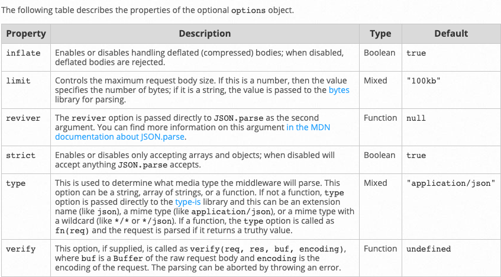

# express js

büyük request bodyleri parse etmek gerekiyor. Bunun için middleware kullanılıyor. Request işlenmeden önce olacaklar gibi düşünebiliriz. body-parser kullanarak büyük bodyleri parse edip (üst limit vereebiliyoruz) requestimiz hangi metoda girecekse problemsiz giriyor. 

app.use(bodyParser.json({ limit: '40MB' }));

artık 40mb kadar parse edebiliyoruz

---
express.json other options
app.use(bodyParser.json({ limit: '40MB' }));
gibi kullanılıyor.
https://expressjs.com/en/api.html

---

quick-db usess better-sqlite3. better-sqlite3 