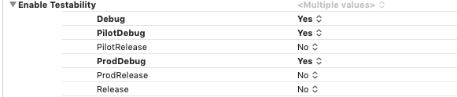
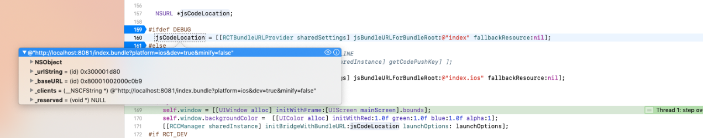

react-native android calistirirken
unable to load script from assets index.android.bundle
try running the command:

```sh
adb reverse tcp:8081 tcp:8081
```
---------

Bununla beraber hakikaten assetslerle ilgili problem olabilir.
Bunun icin asagidaki adimlari izleyerek sorun cozulebilir.

https://medium.com/@impaachu/react-native-android-release-build-crash-on-device-14f2c9eacf18

----

yeni clonelanan rn projesinde android studioda module lerin listelenmesi gerekiyor. Gozukmuyorsa sync project with gradle files buttonuna basiyoruz. sag ustte filli icon.

-----

# ios build problemleri (shift+cmd+v)


macho linker -> eksik kutuphaneyi link etmek gerekiyor
--
versiyon uyusmazliklarindan kahynakli build problemlerinde alternatif olarak kontrol edilmesi gereken alanlardan biri commandline tools versiyonu.
---
xcode --> preferences --> command line tools 
---
uygulama baska makinede başka bir xcode versiyonunda başarılı bir şekilde çalışıyorsa alternatif olarak denemek için iyi bir opsiyon.


# ios export certificate with pk

EXPORTING THE CERTIFICATE
Open Keychain Access.
In Category panel, select Certificates.
Select the certificate you want to export (should be named something like: iPhone Distribution: [Original Developer Name]).
Highlight both the certificate and its private key.
Right-click and select Export 2 items.
Select location to save p12 file.
(Optional)Enter a password - this will be used to install it on the other machine.
Press Save.

*****


Android  android/build.gradle dizininde

def enableSeparateBuildPerCPUArchitecture = false
parametresi 2 apk oluşturup oluşturmama ayrımına yarar. true verilince arm ve x86 mimarili cihaz hedef alınarak 2 apk oluşturulur. Bu sayede 4mb kadar küçülür uygulama. apk içerisine gereksiz native kod eklenmemiş olur. 2 apk store a birlikte yüklenir. google play ve amazon bu şekilde uygulamayı kabul etmektedir. insanlar indirirken otomatik olarak cihazları için hangisi uygunsa kullanıcıya o gösterilir. apk lara özgü farklı şeyler yapılamamakta. arm olanları 5 tl ye satayım, x86 ları 7 tl ye satayım gibi kurnazlıklar da yapılamamakta . :)

---------

Ios ta pod install yaparken pod command not found için 

```sh
$ sudo gem install cocoapods
```

----

iOS notes

Argument list too long: recursive header expansion failed#1407


Ios/build folder sil

Xcodedan build yap

——————————————

Macho linker 


Proje — build phases — link binary with libraries de istenmeyen bir kutuphane kalmistir

--

POD REINSTALL

Pod deintegrate

pod cache clean --all

pod cache clean 'alamofire'

pod cache clean 'alamofire' --all


Pod install


-------

Android Duplicate resoursec problemi ve enteresan cozumu

https://github.com/facebook/react-native/issues/22234

----------


XCode build variant

2 farklı firebase dosyasını farklı otamlar için aynı branchte kullanma (ios)

build phase için kullanılan script.

*****
```sh

# Name of the resource to copy
INFO_PLIST_FILE=GoogleService-Info.plist

# Get references to debug and release versions of the plist file
DEBUG_INFO_PLIST_FILE=${PROJECT_DIR}/Firebase/Development/${INFO_PLIST_FILE}
RELEASE_INFO_PLIST_FILE=${PROJECT_DIR}/Firebase/Production/${INFO_PLIST_FILE}

# Make sure the debug version exists
echo "Looking for ${INFO_PLIST_FILE} in ${DEBUG_INFO_PLIST_FILE}"
if [ ! -f $DEBUG_INFO_PLIST_FILE ] ; then
echo "File GoogleService-Info.plist (debug) not found."
exit 1
fi

# Make sure the release version exists
echo "Looking for ${INFO_PLIST_FILE} in ${RELEASE_INFO_PLIST_FILE}"
if [ ! -f $RELEASE_INFO_PLIST_FILE ] ; then
echo "File GoogleService-Info.plist (release) not found."
exit 1
fi

# Get a reference to the destination location for the plist file
PLIST_DESTINATION=${BUILT_PRODUCTS_DIR}/${PRODUCT_NAME}.app
echo "Copying ${INFO_PLIST_FILE} to final destination: ${PLIST_DESTINATION}"

# Copy the appropiate file to app bundle
if [ "${CONFIGURATION}" == "Debug" ] ; then
echo "File ${DEBUG_INFO_PLIST_FILE} copied"
cp "${DEBUG_INFO_PLIST_FILE}" "${PLIST_DESTINATION}"
else
echo "File ${RELEASE_INFO_PLIST_FILE} copied"
cp "${RELEASE_INFO_PLIST_FILE}" "${PLIST_DESTINATION}"
fi


```

******
kullandıgım kaynaklar

https://medium.com/@andersongusmao/xcode-targets-with-multiples-build-configuration-90a575ddc687
https://gist.github.com/tylermilner/f8e9121d62c890cb707bc1810a7d57d9


-----


build 
app - project- build settings içerisinde uygulama configleri arasında debuggable olma olmama özelliği seçilebiliyor. Debug kelimesi içeren konfigürasyonlar debuggable geliyor fakat bu değer değiştirielebilir.




---------


Ios ta ekli bir kütüphane (lbrries içinde) 

aşağıdaki modüllleri bulamıyorsa 

React/RCTBridgeModule.h
React/RCTEventEmitter    vb core modülleri bulamıyorsa  node-modules içinde react-native altından react projesinin içinde libReact.a yı xcodeda link library  with binaries altına ekledim.

-----------


içinde clang geçen hatalar compiler ile ilgili. Muhtemelen projede olmayan bir şeyi compile etmeye çaışıyorsun. veya eklediğin bir kütüphaneyi linked llibrary with binaries altına elkemedin. 


---------

tüm simalor vs öldürme 

sudo killall -9 com.apple.CoreSimulator.CoreSimulatorService


-----


react native debug mode da çalışırken ios uygulaması npm e bağlanacağı yer appDelegate.m sayfasında 
jsCodeLocation = [[RCTBundleURLProvider sharedSettings] jsBundleURLForBundleRoot:@"index" fallbackResource:nil]; satırıdır.
 Bağlanacağı adresi dinamik olarak almaktadır. Fakat farklı konfigürasyonda bu alan nil gelmektedir. debug mode da aşağıdaki gibi doğru adresi almaktadır. fakat konfigürasyonu değiştirince gelen değer nil dir. bu sebeple uygulama npm e bağlanamıyor. (bunun bir çözümü olmalı ?)




https://stackoverflow.com/questions/38780325/running-react-native-app-on-ios-device-using-offline-bundle


----------


80-90 tane 64 bitlik mimariye uygun olmayan hatalar çıkarsa sebebi

Make sure JavaScriptCore.framework is added to "Link Binary With Libraries"

share


-----------------------------------


react native de rctwebsocket debug edebilmek için var.


--------

podfile içindeki #use_frameworks swift tabanlı podlar için var. Hem swift hem obj c podlar birarada olunca birbirine dependent kütüphaneler importları beceremiyor. Bunun çözümü ya yeni eklenen kütüphanenin en sonki obj c halini bulup eklemek, ya da obj-c bridging header da ihtiyac olunan obj c header larını import etmek. Böyle olunca headerlar swift tarafına expose ediliyor ve dependent kütüphaneler birbirini bulabiliyor.

--------


pod update yaparken smartquotes gibi bir hata alırsak cocoapods versiyonumuz eski demektir.

```sh
$ sudo gem install cocoapods
```
