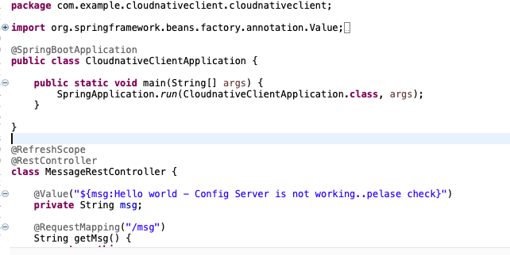

@SpringBootApplication
public class ConfigClientApplication {
    public static void main(String[] args) {
        SpringApplication.run(ConfigClientApplication.class, args);
    }
}
@RefreshScope
@RestController
class MessageRestController {
    @Value("${message:Hello default}")
    private String message;
    @RequestMapping("/message")
    String getMessage() {
        return this.message;
    }
}

The default configuration only allows the values to be read on the client’s startup and not again. So, using @RefreshScope we force the bean to refresh its configuration, which means it will pull updated values from the Config Server, and then trigger a refresh event.

------

management.security.enabled=false will disable the spring security on the management enpoints like /env, /refresh etc. This is for development settings, in production security should be enabled.

------

configleri guncelledikten sonra mikroservisleri yeniden başlatmaya gerek duymadan configleri çekmek için aşağıdaki komutları kulanıyoruz.  

curl -X POST http://localhost:8080/actuator/refresh

bununn için dependencylerimiz arasında actuator bulunmalı. main application içerisinde de @refreshScope anotasyonu olmalı. Örneğin

refreshscoope un olması tamamen yeterli değil, bootstrap.properties içerisinde management.endpoints.web.exposure.include=refresh
ekli olmalı.

Bu şekilde actuator ile gelen özelliklerden refresh i kullanabiliyoruz. health vb gibi endpointler de mevcut. 
management.endpoints.web.exposure.include=* dersek tüm enpointleri bizim için expose ediyor actuator. 

actuator dokümanı

-------
https://docs.spring.io/spring-boot/docs/current/reference/html/production-ready-endpoints.html
-------
